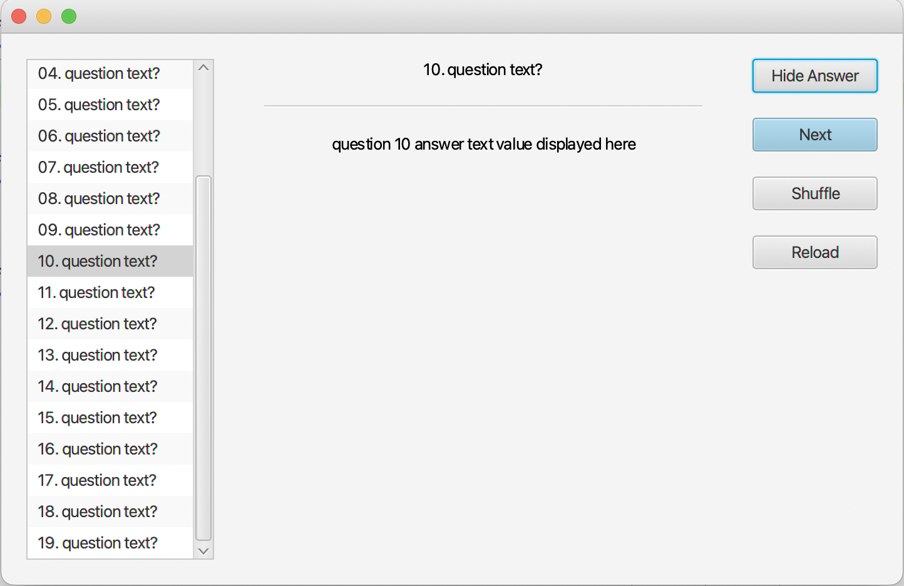

# Getting Started

Welcome to FlashCards. Here is a guideline to help you get started with the project in Visual Studio Code.

## Launch App

In the terminal from the project root folder execute:

```sh
. script/run
```

This will launch the app and keep it running until interrupted e.g. `Ctrl+C`, or the exit button is clicked.



## Folder Structure

The workspace contains two folders by default, where:

- `src`: the folder to maintain sources
- `lib`: the folder to maintain dependencies

Meanwhile, the compiled output files will be generated in the `bin` folder by default.

> If you want to customize the folder structure, open `.vscode/settings.json` and update the related settings there.

## Dependency Management

The `JAVA PROJECTS` view allows you to manage your dependencies. More details can be found [here](https://github.com/microsoft/vscode-java-dependency#manage-dependencies).
